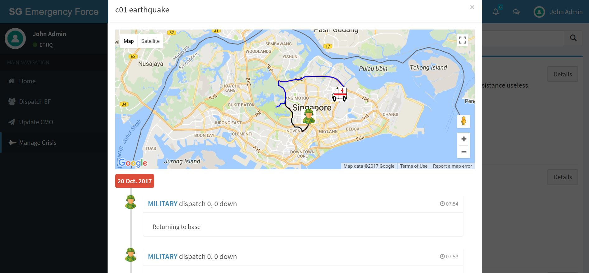
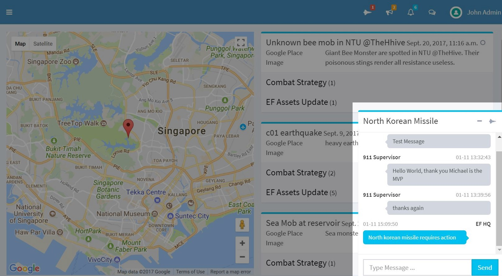
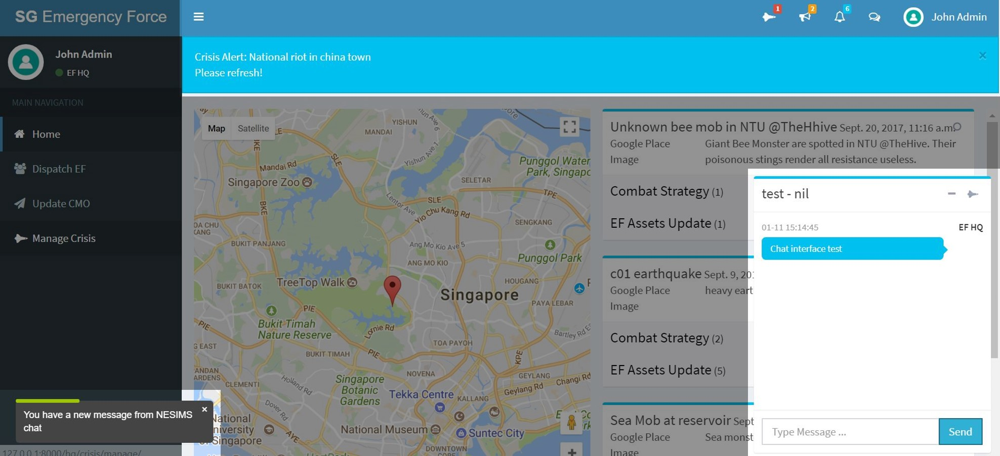

# SG-EF System
CZ3003 Project - SG Emergency Force System

## Overview
`SG-EF`, also called the `SG Emergency Force System`, is a prototype Web app + RESTful API server app that the SG Emergency Force uses for communication of `crisis combat instructions` with its sub-divisions. The `SG-EF` system receives new `crisis` events and executive orders from the Crisis Management Office System and will be responsible for updating back to the CMO System real-time updates when situation about the crisis changes.

## Stakeholders
- Emergency Force HQ
- EF Assets (Emergency Force HQ sub-divisions)
- Crisis Management Office System

## Key Features

#### 1. EF Assets movement tracking
The software web application is able to perform movement tracking of EF Assets and represent their movement across the Singapore map through Google Map visualization for each crisis.

#### 2. Chat interface with `NESIMS` stakeholders
Through real-time chat interface embedded into the application, the SG Emergency Force can communicate with `NESIMS` stakholders real-time, allowing the EF to be responsive to emerging crises.

#### 3. Dynamic push notification for crisis alerts, combat strategy, EF updates
Websocket technology improve the responsiveness of the SG Emergency Force by enforcing real-time push notifications and updates through an event-driven approach.

## Technology used
- Websocket
- JQuery
- AJAX
- CSS
- Django Web Application
- Django REST Framework

## Installation guide
- [Setting up redis-server](IMPL-CHANNELS.md)
- [Setting up the web application](INSTALL.md)
